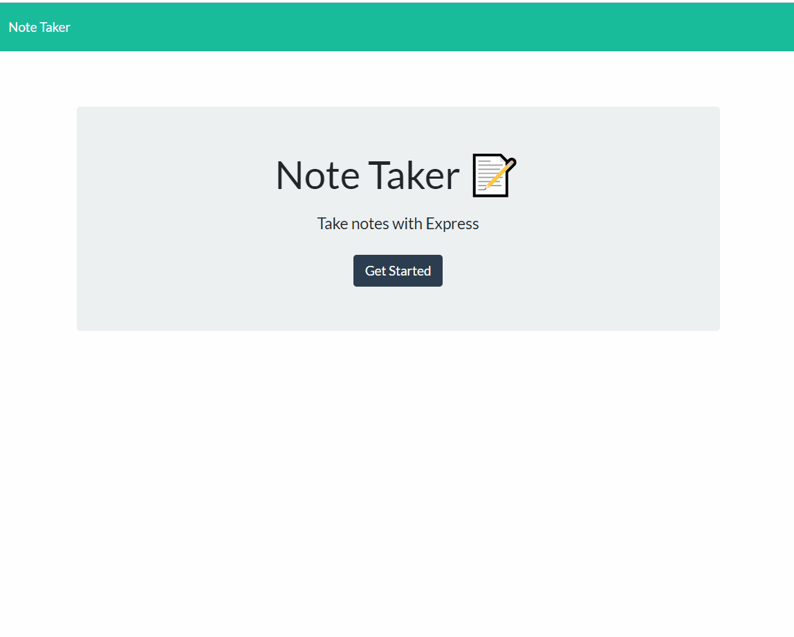

# Note Taker
Note Taker

[[Repository Link](https://github.com/ElusiveSkies/note_taker)]

[[Deployed Note Taker](https://fierce-hollows-30732.herokuapp.com/))]

## Table of Contents

- [Description](#Description)
- [Usage](#Usage)
- [License](#License)
- [Questions](#Questions)

## Description

User will navigate from the landing page to the notes page.

On the notes page, user will add content for the title and content of the note. The user will then have the opportunity to click the save icon and the note will be stored and added with the other notes on the left side of the page.

The stored notes, on the left, are available to recall when clicked on, displaying its contents in the right column.
Clicking the trash icon for stored notes will remove them.

Clicking on the + icon clears the fields for title and content.
Clicking the Note Taker icon will allow user to return the landing page.

## Usage

Video of Usage

## License

MIT

## Questions

[[Contact me](mailto:elusiveskies@gmail.com)]

[[Elusiveskies](https://www.github.com/Elusiveskies)]